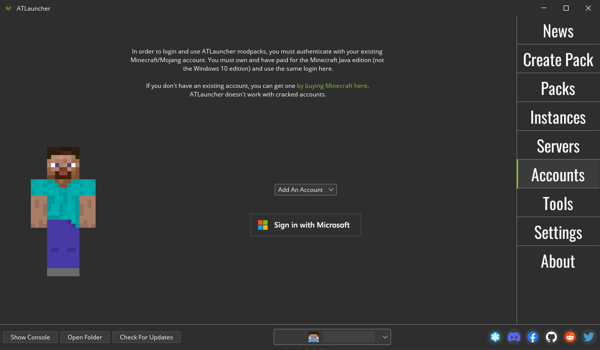
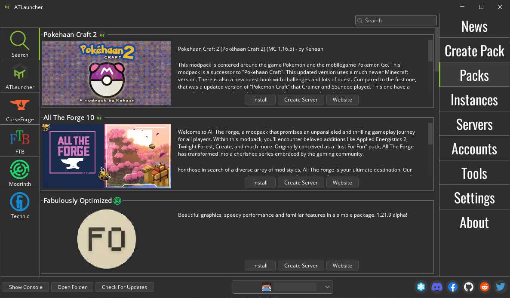
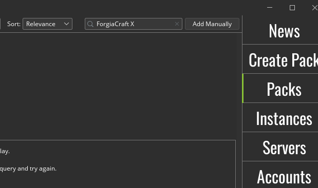

# Guida per ForgiaCraft X

Guess who's back

## Requisiti

- Licenza a pagamento per Minecraft Java Edition
- Launcher compatibile Modrinth (ad esempio ATLauncher)

## Installazione

### Licenza a pagamento

1. Scaricare e installare un launcher compatibile. In questa guida verrà usato come esempio ATLauncher, tuttavia dovrebbe andare bene qualunque launcher che permette di scaricare modpack da Modrinth.
    - Link: [ATLauncher](https://atlauncher.com/downloads)
2. Se richiesto, fare login con le credenziali Microsoft per usare la licenza di Minecraft.

3. Trovare la sezione di ricerca modpack, eventualmente nella sezione di Modrinth. Per ATLauncher:
    - Cliccare "Packs" nel menu a destra 

    - Cliccare "Modrinth" nel menu a sinistra 

    - Cercare "ForgiaCraft X" in alto a destra nella barra di ricerca 

    - Cliccare "Install" e selezionare l'ultima versione disponibile
4. Avviare il modpack. Per ATLauncher:
    - Cliccare "Instances" nel menu a destra
    - Cliccare "Play" nella sezione di ForgiaCraft X
5. Finito!

Se qualcuno vuole utilizzare un altro launcher e documentare il processo, verrà incluso in questa guida.

Per ulteriore supporto, potete scrivere nel gruppo apposito e/o chiedere a Pit e Davide Merli.

## Aggiornamenti

A volte sarà necessario aggiornare il modpack, ad esempio in caso di modifica delle mod o dei config. Per ATLauncher, sarà necessario cliccare "Update" nella sezione di ForgiaCraft X.

## Gioco

ForgiaCraft X è ambientato su una grande isola. Per questo motivo, è suggerito utilizzare la voicechat integrata nel server per interagire e cooperare con gli altri giocatori. Se avete bisogno di aiuto, a ogni giocatore verrà fornito un libro di benvenuto con qualche consiglio sul gioco.

Se volete abbandonare l'isola, a vostro rischio e pericolo.
